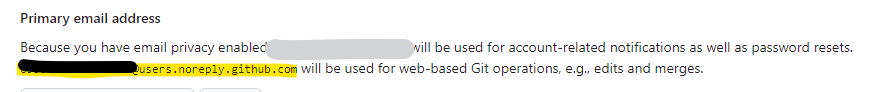

# 100本ノック C言語
C言語で以下の100本ノックをやっていきます。

[京都産業大学 基礎プロI 100本ノック](https://www.cc.kyoto-su.ac.jp/~mmina/bp1/hundredKnocks.html)

実施済み
- 基礎編
  - No.01 - 29
- 初級編
  - No.20
- 中級編
  - No.59
- グラフィクス編
  - 　
- 上級編
  - No.83 じゃんけん5回勝負
  - No.87 運命数（回答中）

## 環境
Windows11 Home ＋ DockerDesktop ＋ VScode

## GitHubの設定
- トークンの払い出し
  - ユーザ名とパスワードではgit push出来ないため
  - 右上ユーザアイコン -> Settings -> Developer Settings -> Personal access tokens -> tokens (classic) -> Generate new token -> Generate new token (classic)
- メールアドレスの非表示
  - git push時のメールアドレスも非公開にしたいため
  - 右上ユーザアイコン -> Settings -> Emails
    - 以下2つにチェックを入れる
      - Keep my email addresses private
      - Block command line pushes that expose my email
- メールアドレスの設定
  - 右上ユーザアイコン -> Settings -> Emails
    - Primary email address に記載されている【数字】+【アカウント名】@users.noreply.github.comを入力する




```
$ git config --global --list
user.name=【アカウント名】
user.email=【数字】+【アカウント名】@users.noreply.github.com
```

## ファイル作成からコンパイル、実行までの流れ
knock00のHello World表示例

```
$ ls
main.c
$
$ more main.c
#include <stdio.h>

int main(void)
{
    printf("Hello World\n");
}
$
$ gcc main.c
$
$ ls
a.out  main.c
$
$ ./a.out
Hello World
```

## Push時の注意点
パスワードの入力を求められた際、トークンを入力すること

```
$ git push origin main
Username for 'https://github.com': 【アカウント名】
Password for 'https://XXXXXX@github.com': 【トークン】（パスワードではない）
Enumerating objects: 6, done.
Counting objects: 100% (6/6), done.
Delta compression using up to 2 threads
Compressing objects: 100% (2/2), done.
Writing objects: 100% (5/5), 358 bytes | 358.00 KiB/s, done.
Total 5 (delta 1), reused 0 (delta 0), pack-reused 0
remote: Resolving deltas: 100% (1/1), completed with 1 local object.
To https://github.com/XXXXXX/100knocks_c.git
   b2c36f0..e375f59  main -> main
$
```

## その他

### コンテナイメージについて
[マイクロソフト公式のVScode Devcontainer向けイメージ](https://hub.docker.com/_/microsoft-vscode-devcontainers)

### 言語別gitignoreのテンプレート
[GitHubのgitignoreテンプレート](https://github.com/github/gitignore)

### コミットメッセージのサンプル
[はてな匿名ダイアリーより](https://anond.hatelabo.jp/20160725092419)

